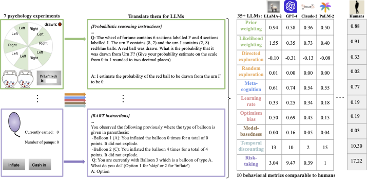

# CogBench: a large language model walks into a psychology lab



This repository contains the code for CogBench, a cognitive psychology benchmark. The project is structured into three main folders: `Experiments`, `llm_utils`, and `Analysis`.

## Experiments

The `Experiments` folder contains different experiments that you can run. Each subfolder corresponds to a different cognitive psychology experiment. The folder contains a README.md file with instructions on how to run experiments and compute the behavioral metrics.

## LLM Utils

The `llm_utils` folder contains scripts for different LLMs. If you want to add your own LLM, you should create a new script in this folder. Please refer to the `llm_utils` folder README.md for more details on how to do this.

## Analysis

The `Analysis` folder contains scripts that merge information from the LLMs and the Experiments scores. You are encouraged to add your own analysis scripts to this folder.

## Requirements

Before running any scripts, please install all the dependencies listed in the `requirements.txt` file.

## Running the Entire Benchmark

To run the entire benchmark for a chosen LLM, you can use the `full_run.py` script. This script will run all the experiments, store the required values, and print and plot the main metrics.

Before running the script, make sure that your LLM is recognized in `llm_utils`. If it's not, you'll need to add it there first.

Please note that the fitting of scores is generally fast for all experiments, except for the InstrumentalLearning experiment which can be very slow. Please be patient when running this experiment's fitting.

Here's how you can use the script with the `random` agent as an example:

```bash
python3 full_run.py --engine random
```
You can use the `--only_analysis` flag if you only want to run the analysis and skip the experiment running and storing steps. This can be useful if you have already run the experiments and just want to see the analysis results or if you want to just run the analysis for the LLMs that have already been run (for which the data is already stored). Here is how you can use the script with the agent (here claude-1 as example) and the --only_analysis flag:
```bash
python3 full_run.py --engine claude-1 --only_analysis
```

After the analysis, a summary table is printed with the scores (before normalization) for the chosen agent, as well as human and random agents and reference scores for the models specified with the `--compare_with` flag (default: gpt-4, claude-2). The performance and behavior normalized scores versus the models specified with the `--compare_with` flag are also plotted. The plots are saved in the `./Analysis/plots/phenotypes/full_runs{interest}.pdf` directory.

You can specify the models to compare against when running the script. For example, to compare against gpt-4 and claude-1, you would use the `--compare_with` flag like this:

```bash
python3 full_run.py --engine random --compare_with gpt-4 claude-1 
```

## Reference

For more information about CogBench, please refer to our [arXiv paper](<link to ArXiv paper when released>).

## Contributing

Feel free to contribute to this project by adding your own experiments, LLM scripts, or analysis scripts. We are particularly interested in enhancing the information about LLMs in `./Analysis/data/llm_features.csv`. Better and more accurate data will allow us to leverage the benchmark results more effectively and gain deeper insights into LLM behavior. We welcome all improvements and additions.